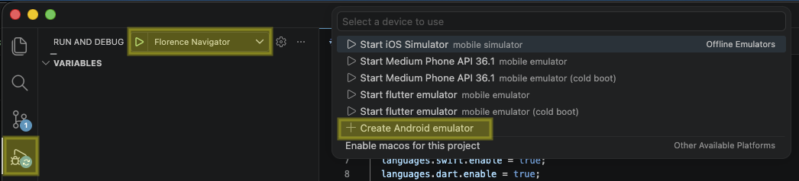
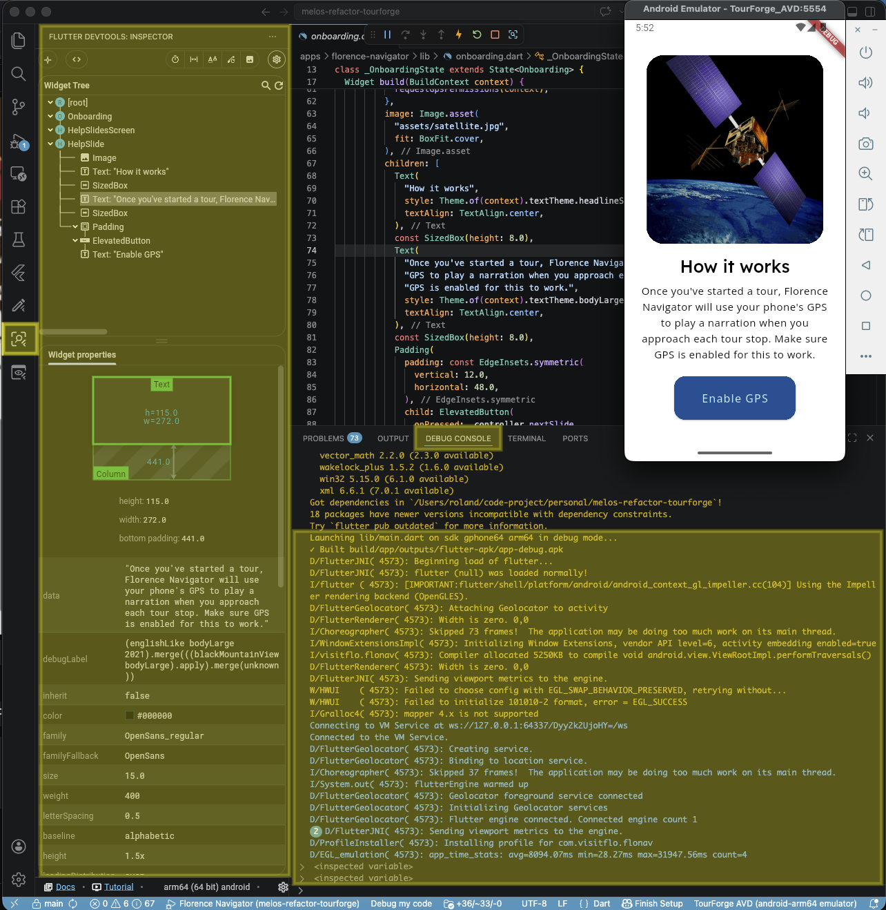

# Virtual (Emulator/Simulator)
## iOS
TourForge currently does not support running iOS Simulator via command-line such as `flutter run` and similar things. We currently only support running the simulator graphically via Xcode.

On first launch, make sure you had run `flutter pub get` and `pod install` prior. Then on Xcode welcome screen, open existing project, with the workspace file found at `ios/Runner.xcworkspace`.

Check the following indicators to see if you could build and run simulator. First is that the target device should be a name of a real iPhone model. And that there is nothing weird or warning you on the Signing portion.


If in doubt, try and run it anyway and see what happens. To build and run, click on the play icon near the top left.

## Android (Deprecated)
If this is the first time TourForge was setup on your device, then you can create an AVD with the following command:
```sh
avdmanager create avd --force --name my-android-emulator-name --package 'system-images;android-35;google_apis_playstore;arm64-v8a'
```

NOTE: Creating a custom hardware profile can be ignored. Also, the error of something like `Warning: Observed package id 'ndk;29.0.14206865' in inconsistent location...` can be safely ignored.

Then run said AVD with:
```sh
emulator -avd my-android-emulator-name
```

You can check what AVDs are available with `emulator -list-avds`.

At this point, an UI showing Android boot screen should show up. Wait for the device to fully booted up and then in a terminal, run `flutter run` and follow the interactive prompt to install the development build on the device.

## Android with Run Configuration

This is paired with VSCode and extensions to bring tightly intergrated debug experience. Instead of manually creating AVD and manually compile and load the debug app into the device, we do 1-click run in VSCode and utilize the Flutter extension for full graphical debug.

This run config came built-in via the commited file for VSCode workspace settings `.vscode/launch.json`. This is more of a how to start debug guide rather than creating a virtual device guide, because while starting debug VSCode will have a selection menu that trivializes AVD creation.



Note that in that dropdown select menu, the iOS Simulator option will not work and neither does "Medium Phone API xx.x". After your very first debug session with an AVD created, the subsequent run you can select "flutter emulator".



Check the `Debug Console` and the highlighted Flutter sidebar tab for full debug details.

# Physical (Real Devices)
For this, all devices must be physically plugged into the development machine.


## iPhone Setup
Complete the following steps:
- Device must be logged in with an Apple ID that is associated with the Apple Developer Team. Otherwise Apple won't sign the development build to run on the device.
- Enable developer mode
    - Follow this documentation (https://developer.apple.com/documentation/xcode/enabling-developer-mode-on-a-device)

## Android Setup
Complete the following steps:
- Enable developer options and then enable USB debugging
    - Follow the top portion of this documentation (https://developer.android.com/studio/debug/dev-options)
