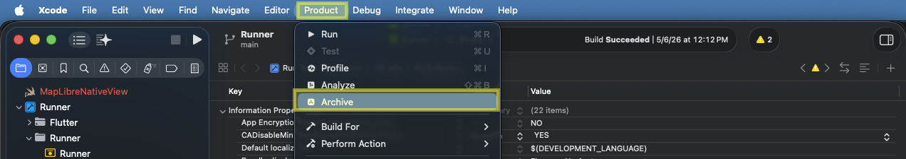
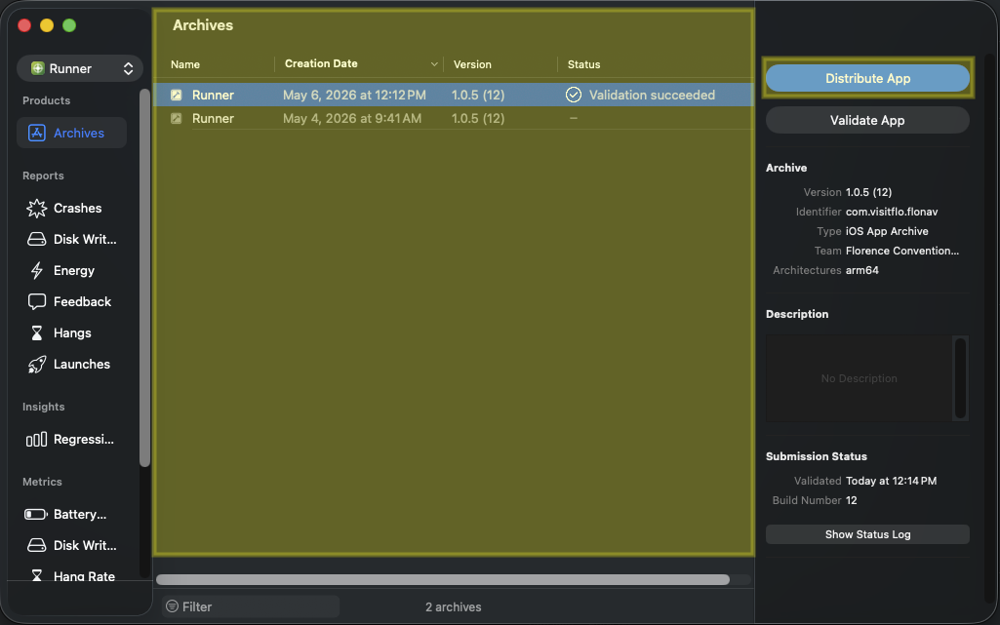
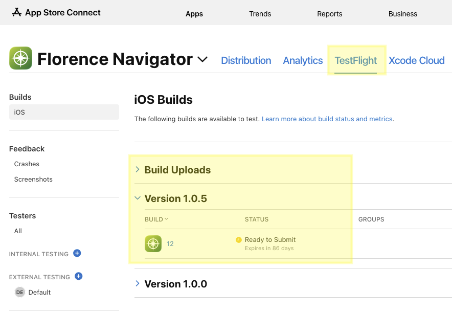
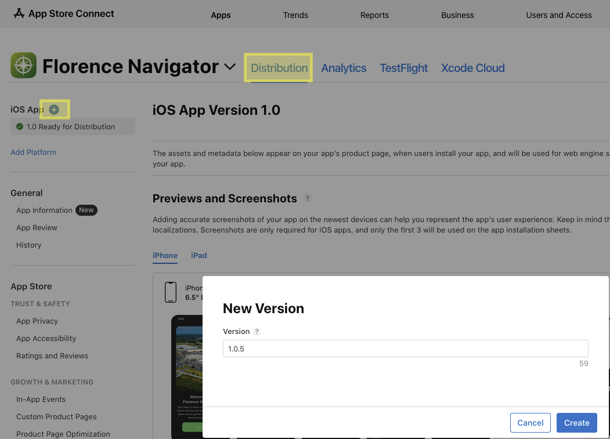
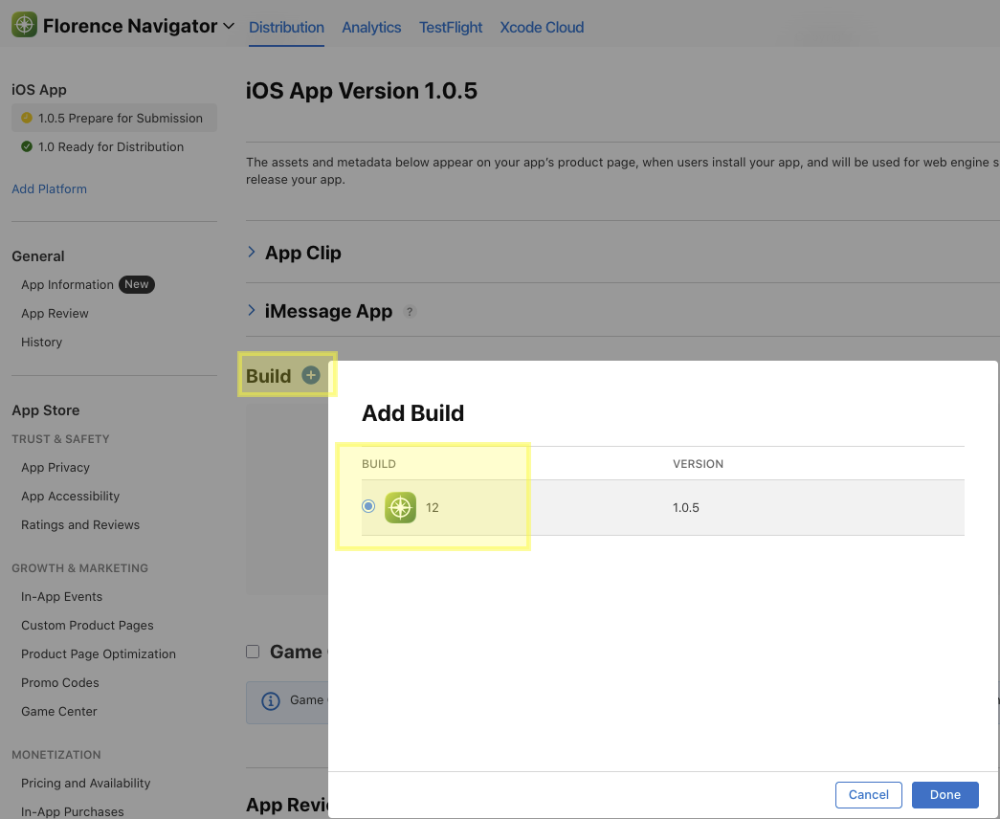
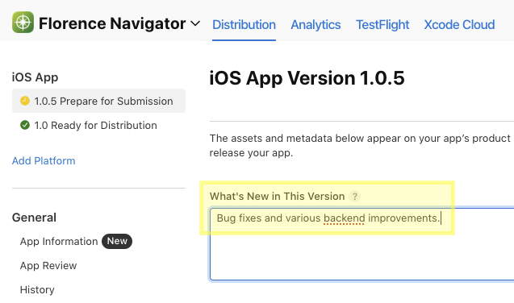
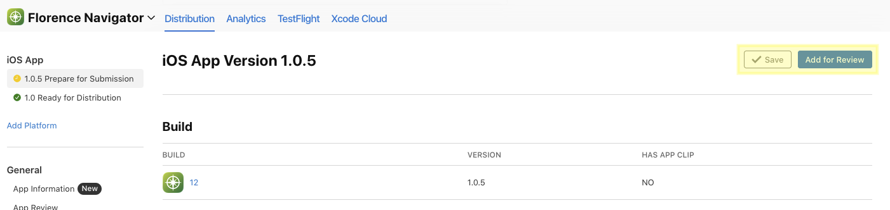
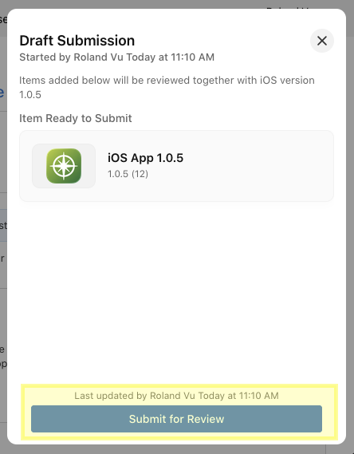

# Publish Existing App to Apple App Store

This can be done via Xcode. First, in the Menu Bar of Xcode, click `Product > Archive`. When asked about Xcode Cloud, ignore, we don't need to maintain more CI/CD for project this small.

When you click `Archive` it will build the app once. If succeed, Xcode will open a new dialog box, showing the Archive entry for the app that it just built. To submit this build to the app store developer team, click `Distribute App` as shown. The process can take a while.

When finished uploading, go to (https://appstoreconnect.apple.com/apps) to choose the correct app that you just uploaded an archive to, and then go to the `TestFlight` tab:

You will see the app version and the app build number like Xcode app info specification. Take note of the Status. In the screenshot, some time has passed and Apple had finished processing the uploaded archive. But right after Xcode finishes uploading and when you go to check the status it might say Pending or Processing for a while.

DISCLAIMER: Like Google app store, they want you to increment app version (e.g. 1.0.0, 1.0.5, etc...) which we can specify in whatever format we want (wthin reasons). But the build number is more restricted as it can only be whole number incrementing, this is usually taken as the tally for the number of times a new app build is submitted to an app store.

Once the archive says it is Ready to Submit, go to `Distribution` and click the blue plus button to add a new app update to an existing app:

Scroll down until you see `Build` and tell Apple which uploaded build to use for the update:

It is required that we provide a release note for what the app update was about, usually a generic statement like the following will suffice.

Click `Save` once, then the `Add for Review` blue button will unlock. There will be right-side panel pop up for confirming review submission:

Once you clicked that, all is done maybe a prayer that Apple will pass our submission without delay!